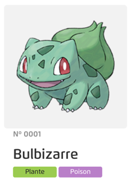

# Pokédex

## Supports
- [Doc PokéAPI](https://pokeapi.co/docs/v2)
- [Doc SvelteKit](https://kit.svelte.dev/docs)

### Page d'accueil
> Path : `/`

Sur cette page, l'utilisateur doit pouvoir voir la liste des générations de Pokémon mais aussi les différentes régions.

#### Liste des régions

| Nom    | Url                                    |
|--------|----------------------------------------|
| Kanto  | `https://pokeapi.co/api/v2/region/1/`  |
| Johto  | `https://pokeapi.co/api/v2/region/2/`  |
| Hoenn  | `https://pokeapi.co/api/v2/region/3/`  |
| Sinnoh | `https://pokeapi.co/api/v2/region/4/`  |
| Unys   | `https://pokeapi.co/api/v2/region/5/`  |
| Kalos  | `https://pokeapi.co/api/v2/region/6/`  |
| Alola  | `https://pokeapi.co/api/v2/region/7/`  |
| Galar  | `https://pokeapi.co/api/v2/region/8/`  |
| Hisui  | `https://pokeapi.co/api/v2/region/9/`  |
| Paldea | `https://pokeapi.co/api/v2/region/10/` |

### Liste des générations
| Nom             | Url                                     |
|-----------------|-----------------------------------------|
| Génération I    | https://pokeapi.co/api/v2/generation/1/ |
| Génération II   | https://pokeapi.co/api/v2/generation/2/ |
| Génération III  | https://pokeapi.co/api/v2/generation/3/ |
| Génération IV   | https://pokeapi.co/api/v2/generation/4/ |
| Génération V    | https://pokeapi.co/api/v2/generation/5/ |
| Génération VI   | https://pokeapi.co/api/v2/generation/6/ |
| Génération VII  | https://pokeapi.co/api/v2/generation/7/ |
| Génération VIII | https://pokeapi.co/api/v2/generation/8/ |
| Génération IX   | https://pokeapi.co/api/v2/generation/9/ |
---
### Page d'une région
> Path : `/region/{numRegion}`

Sur cette page, l'utilisateur doit pouvoir voir la liste des Pokémon de la région sélectionnée.
Avec les urls au-dessus, vous pouvez récupérer les informations des régions et les liens vers les informations des Pokémon de la région.

Pour chaque Pokémon, vous devez afficher son nom, son image et son type sous forme d'une carte.
Exemple de carte :

:warning: On veut éviter de charger tous les pokémons en même temps, il faut donc afficher les 20 premiers et charger les suivants au fur et à mesure que l'utilisateur en démandera avec un bouton en bas de la liste.

### Page d'une génération
> Path : `/generation/{numGeneration}`

On veut faire la même chose pour les générations, mais cette fois-ci, on veut afficher les régions de la génération sélectionnée.